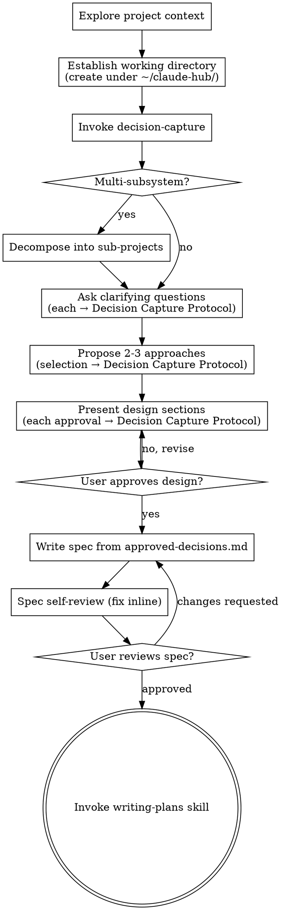

# Brainstorming+ (Ideas Into Designs)

Turn ideas into fully formed designs and specs through collaborative dialogue — capturing every decision explicitly and writing a spec precise enough to be the source of truth for planning and implementation.

**REQUIRED SUB-SKILL:** Invoke `decision-capture` at the start of every brainstorm and keep its protocol governing throughout. Every decision you capture — a clarifying answer, an approach selection, a design-section approval, a mid-stream change — goes through its Decision Capture Protocol: restate the user's input in concrete content → wait for explicit confirmation → write to `approved-decisions.md` in the same turn. The spec is assembled only from that file. Its rules on no-bundling, restate-on-ambiguous-affirmation, and no-silent-absorption apply at every capture moment here.

Start by understanding the current project context, then ask questions one at a time to refine the idea. Once you understand what you're building, present the design and get user approval.

<HARD-GATE>
Do NOT invoke any implementation skill, write any code, scaffold any project, or take any implementation action until you have presented a design and the user has approved it. This applies to EVERY project regardless of perceived simplicity.
</HARD-GATE>

## Working directory

A brainstorm's artifacts — `approved-decisions.md` and the spec — always live under the hub at `~/claude-hub/`, **never** in the current repo and **never** wherever the cwd happens to be. Do not assume you are in the hub; you may be invoked from a hub project or from an actual source repo (e.g. inflow-ats). One won't exist when you're invoked, so create it.

- Work tied to a specific project → `~/claude-hub/<project>/_in-progress/<artifact-name>/` (e.g. inflow-ats work → `~/claude-hub/inflow-ats/_in-progress/<artifact-name>/`)
- Hub-level or cross-cutting work → `~/claude-hub/_in-progress/<artifact-name>/`
- If which project it belongs to isn't clear, ask before creating.

Create this directory before any decision is captured, so `decision-capture` has a place to write `approved-decisions.md`.

## Anti-Pattern: "This Is Too Simple To Need A Design"

Every project goes through this process. A todo list, a single-function utility, a config change — all of them. "Simple" projects are where unexamined assumptions cause the most wasted work. The design can be short (a few sentences for truly simple projects), but you MUST present it and get approval.

## Checklist

Create a task for each of these items and complete them in order:

1. **Explore project context** — check files, docs, recent commits
2. **Establish the working directory** — create it under `~/claude-hub/` per the Working Directory rule above; never write into the current repo or assume the cwd
3. **Invoke `decision-capture`** — load it before any decision is on the table, so its protocol governs every capture from here on
4. **Assess scope** — if the request spans multiple independent subsystems, flag it and decompose into sub-projects before refining details (see below)
5. **Ask clarifying questions** — one at a time, understand purpose/constraints/success criteria; each resolved answer runs the Decision Capture Protocol
6. **Propose 2-3 approaches** — with trade-offs and your recommendation; the selection runs the Decision Capture Protocol
7. **Present design** — in sections scaled to complexity, get user approval after each section; each approval runs the Decision Capture Protocol
8. **Write spec** — assembled from `approved-decisions.md`, following the Spec Language Requirements below; no new decisions appear here
9. **Spec self-review** — inline check for placeholders, contradictions, ambiguity, scope (see below)
10. **User reviews written spec** — ask the user to review the spec file before proceeding
11. **Transition to implementation** — invoke the `writing-plans` skill

## Process Flow

**The terminal state is invoking `writing-plans`.** Do NOT invoke `frontend-design`, `mcp-builder`, or any other implementation skill. The ONLY skill you invoke after brainstorming is `writing-plans`.

## The Process

**Understanding the idea:**

- Check out the current project state first (files, docs, recent commits)
- Before asking detailed questions, assess scope: if the request describes multiple independent subsystems (e.g., "build a platform with chat, file storage, billing, and analytics"), flag this immediately. Don't spend questions refining details of a project that needs to be decomposed first.
- If the project is too large for a single spec, help the user decompose into sub-projects: what are the independent pieces, how do they relate, what order should they be built? Then brainstorm the first sub-project through the normal design flow. Each sub-project gets its own spec → plan → implementation cycle.
- For appropriately-scoped projects, ask questions one at a time to refine the idea
- Prefer multiple choice questions when possible, but open-ended is fine too
- Only one question per message — if a topic needs more exploration, break it into multiple questions
- Focus on understanding: purpose, constraints, success criteria
- For any detail discoverable in the codebase (callers, file paths, signatures, schema, existing patterns), investigate rather than asking the user — `decision-capture` requires this and names `investigating-before-answering` as the tool

**Exploring approaches:**

- Propose 2-3 different approaches with trade-offs
- Present options conversationally with your recommendation and reasoning
- Lead with your recommended option and explain why
- Only offer a third option when a third genuinely exists; do not invent one to fill a slot

**Presenting the design:**

- Once you believe you understand what you're building, present the design
- Scale each section to its complexity: a few sentences if straightforward, up to 200-300 words if nuanced
- Ask after each section whether it looks right so far
- Cover: architecture, components, data flow, error handling, testing
- Be ready to go back and clarify if something doesn't make sense

**Design for isolation and clarity:**

- Break the system into smaller units that each have one clear purpose, communicate through well-defined interfaces, and can be understood and tested independently
- For each unit, you should be able to answer: what does it do, how do you use it, and what does it depend on?
- Can someone understand what a unit does without reading its internals? Can you change the internals without breaking consumers? If not, the boundaries need work.
- Smaller, well-bounded units are also easier to work with — you reason better about code you can hold in context at once, and edits are more reliable when files are focused. When a file grows large, that's often a signal it's doing too much.

**Working in existing codebases:**

- Explore the current structure before proposing changes. Follow existing patterns.
- Where existing code has problems that affect the work (a file that's grown too large, unclear boundaries, tangled responsibilities), include targeted improvements as part of the design — the way a good developer improves code they're working in.
- Don't propose unrelated refactoring. Stay focused on what serves the current goal.

## Spec Language Requirements

The spec is the leverage point of the whole design → plan → implementation chain; a vague or wrong line here multiplies waste downstream. When writing the spec (checklist item 7), every sentence obeys these. Run a self-check pass over the spec body before presenting it.

- **Imperative tense for work.** "Rename `JobApplication#is_active?` to `active?`." Not passive ("is renamed"), future ("will be renamed"), or hedged ("should be renamed," "consider renaming"). Background/current-state sections use present tense for what exists and past tense for history; the imperative rule applies to descriptions of CHANGES, not of STATE.
- **Names and identifiers, not code.** The spec says WHAT changes and WHERE — actual class, method, file, column, route, and verbatim string names, and enumerations of affected call sites. No code blocks, pseudocode, function signatures, or JSON/YAML/SQL literals beyond column-level constraints essential to the design (a column's type, default, null constraint). Implementation shape changes during coding without invalidating the design; don't pin it in the spec.
- **Precision everywhere.** Refer to each thing by its actual identifier (`job_application_ai_summary`, not "the summary"). Describe a case by its distinguishing condition and contents (the email where `applications_count` and `messages_received` are both 0 — not "the empty email"). Use specific verbs (rename, extract, dispatch, persist, aggregate, validate) — never "process," "handle," "manage," "update" unless naming a specific framework concept (the `update` action, ActiveRecord `update`). No generic terms ("the data," "the controller") or unanchored pronouns where a specific referent exists.
- **Question specificity matches spec specificity.** Ask clarifying questions at the detail level the spec will contain — if the spec will name caller files, the question asks about caller files.
- **No file path ends a sentence with a period** — trailing punctuation breaks terminal-clickable links.

## After the Design

**Documentation:**

- Write the validated spec to the location the user prefers; default to a dated design doc co-located with `approved-decisions.md` in the brainstorm's working directory. (User spec-location preferences override this default.)
- The spec is assembled from `approved-decisions.md` — no spec content arises that was not confirmed into that file.

**Spec self-review** — look at the written spec with fresh eyes:

1. **Placeholder scan:** any "TBD", "TODO", incomplete sections, or vague requirements? Fix them.
2. **Internal consistency:** do any sections contradict each other? Does the architecture match the feature descriptions?
3. **Scope check:** is this focused enough for a single implementation plan, or does it need decomposition?
4. **Ambiguity check:** could any requirement be read two ways? Pick one and make it explicit.
5. **Language check:** does the body obey the Spec Language Requirements above (imperative tense, no code blocks, precise identifiers)?

Fix issues inline. No need to re-review — fix and move on.

**User review gate:** ask the user to review the written spec before proceeding. Wait for the response. If changes are requested, make them and re-run the self-review. Only proceed once the user approves.

**Implementation:** invoke the `writing-plans` skill to create the implementation plan. Do NOT invoke any other skill.

## Key Principles

- **One question at a time** — don't overwhelm with multiple questions
- **Multiple choice preferred** — easier to answer than open-ended when possible
- **YAGNI ruthlessly** — remove unnecessary features from all designs
- **Explore alternatives** — propose 2-3 approaches before settling, but only as many as genuinely exist
- **Incremental validation** — present design, get approval before moving on
- **Capture, don't summarize** — each decision is captured under `decision-capture` as it is made; never compress confirmed decisions into a later recap
- **Be flexible** — go back and clarify when something doesn't make sense
